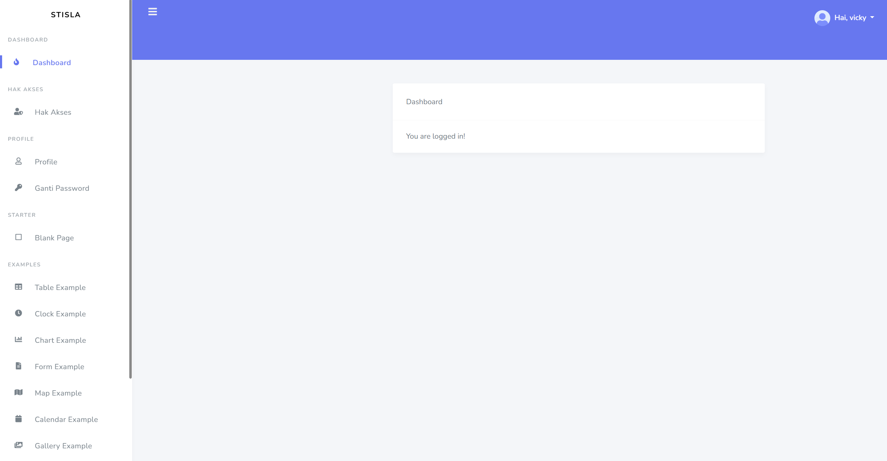

# Health Tracker System

## 🏥 Project Overview
Health Tracker is an innovative healthcare management system that helps users monitor their health status and achieve their wellness objectives. The system features an intelligent diagnostic tool that can identify potential maladies based on entered asymptômes and create personalized health programs.

## 👥 Team Members
- Saker Hajji
- Sofienne Mrabt
- Anas Jraidi
- Hachem Dhawadi
- Oussema Mejri

## 🌟 Key Features
- Intelligent maladie diagnostic system based on asymptômes
- Personal health objective setting and tracking
- Health history management
- Customized wellness programs
- Real-time diagnostic results
- Partner healthcare provider integration
- Smart analytics dashboard with AI insights

## 🛠 Technologies Used
- **Backend Framework:** Laravel 10.x
- **Frontend:** 
  - Bootstrap 5.3
  - JavaScript (ES6+)
  - AJAX for real-time interactions
- **Database:** MySQL
- **Authentication:** Laravel Breeze
- **Icons:** Font Awesome 6.5
- **Additional Libraries:**
  - AOS (Animate On Scroll)
  - Laravel Collective

## 📁 Project Structure
```
project/
├── app/
│   ├── Http/
│   │   ├── Controllers/
│   │   ├── Middleware/
│   │   └── Requests/
│   ├── Models/
│   └── Services/
├── config/
├── database/
│   ├── migrations/
│   ├── factories/
│   └── seeders/
├── resources/
│   ├── views/
│   ├── css/
│   └── js/
├── routes/
└── public/
```

## 🚀 Installation & Setup

### Prerequisites
- PHP >= 8.1
- Composer
- MySQL
- Node.js & NPM

### Installation Steps

1. Clone the repository:
```bash
git clone https://github.com/sakerhajji/laravelProject5Twin3.git
cd laravelProject5Twin3
```

2. Install PHP dependencies:
```bash
composer install
```

3. Install JavaScript dependencies:
```bash
npm install && npm run dev
```

4. Create environment file:
```bash
cp .env.example .env
```

5. Generate application key:
```bash
php artisan key:generate
```

6. Configure your database in .env file:
```
DB_CONNECTION=mysql
DB_HOST=127.0.0.1
DB_PORT=3306
DB_DATABASE=your_database_name
DB_USERNAME=your_username
DB_PASSWORD=your_password
```

7. Run migrations and seeders:
```bash
php artisan migrate
php artisan db:seed
```

8. Start the development server:
```bash
php artisan serve
```

## 🔧 Usage
1. Access the application at `http://localhost:8000`
2. Register a new account or login
3. Start by setting up your health objectives
4. Use the diagnostic tool by entering your asymptômes
5. View your health history and track your progress
6. Follow your personalized wellness program

## 📱 Features in Detail

### Diagnostic System
- Real-time asymptôme matching
- Percentage-based maladie identification
- Comprehensive health history tracking

### Objectives & Progress
- Set personal health goals
- Track progress over time
- Get AI-powered recommendations

### Partner Integration
- Find healthcare providers
- Save favorite medical facilities
- Direct appointment scheduling

## 📸 Screenshots

### Register Page


### Login Page


### Dashboard Page


<<<<<<< HEAD


## 🙏 Acknowledgments
Special thanks to all team members for their dedication and hard work in developing this healthcare management system.

=======
>>>>>>> 172741b665b689bda2fdd9a48fb880ef602e07e0
### Blank Page


### Edit User Profile Page

